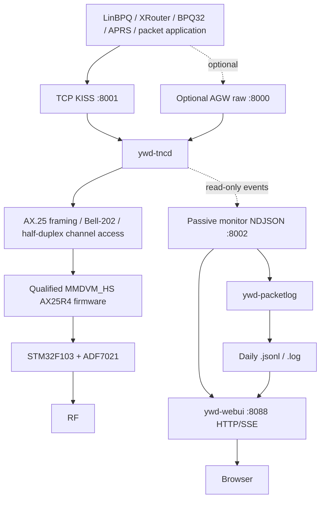

<div align="center">

# YWD-MMDVM-TNC

**A dedicated 1200-baud Bell-202 / AX.25 TNC for supported MMDVM_HS Raspberry Pi HATs**

TCP KISS · optional AGW raw access · passive RX/TX monitor · packet logging · read-only WebUI · reproducible qualified firmware

[](https://github.com/merberg-ai/ywd-mmdvm-tnc/actions/workflows/ci.yml)


</div>

YWD-MMDVM-TNC turns a supported **MMDVM_HS simplex HAT** into a standalone
1200-baud packet modem/TNC for Raspberry Pi. The Raspberry Pi owns the HAT,
Bell-202 modem path, half-duplex channel access, and RF lifecycle; packet
applications talk to it over **TCP KISS** or the optional **AGW raw-frame
interface**.

A separate passive monitor plane exposes decoded RX frames and the complete TX
lifecycle to read-only observers. That monitor drives both persistent packet
logging and the YWD browser dashboard without giving either one transmit
authority.

It is intentionally a **modem boundary**, not another node or BBS. LinBPQ,
BPQ32, XRouter, APRS software, terminals, and other packet applications remain
responsible for connected-mode state, acknowledgements, retries, routing,
digipeating, BBS/node behavior, and application logic.

> [!IMPORTANT]
> YWD-MMDVM-TNC is an alpha project with a deliberately narrow,
> physically-qualified hardware and RF envelope. Read the qualified hardware,
> RF profiles, and safety sections before transmitting.

## Table of contents

- [Highlights](#highlights)
- [Architecture](#architecture)
- [Qualified hardware](#qualified-hardware)
- [Quick install](#quick-install)
- [After installation](#after-installation)
- [WebUI](#webui)
- [Connect packet software](#connect-packet-software)
  - [TCP KISS](#tcp-kiss)
  - [LinBPQ example](#linbpq-example)
  - [AGW raw mode](#agw-raw-mode)
  - [Passive monitor event stream](#passive-monitor-event-stream)
- [Packet logging](#packet-logging)
- [RF operating profiles](#rf-operating-profiles)
- [Configuration](#configuration)
- [Firmware management](#firmware-management)
- [Troubleshooting](#troubleshooting)
- [Safety model](#safety-model)
- [Qualification](#qualification)
- [Repository layout](#repository-layout)
- [License](#license)

## Highlights

YWD-MMDVM-TNC provides a focused packet-radio stack around the MMDVM_HS
hardware:

- **1200-baud Bell-202 AFSK / AX.25** receive and transmit through the qualified HAT firmware;
- **TCP KISS** for local or trusted-LAN packet applications;
- optional **AGW raw-frame** network access;
- live, read-only **schema-1 NDJSON monitor events** for RX and TX lifecycle activity;
- optional `ywd-packetlog` service with human-readable and structured daily logs;
- a physically-qualified, read-only **YWD // PACKET MONITOR WebUI** over HTTP + SSE;
- live traffic, frame inspection, TX lifecycle display, history, daily stats, and console view;
- bounded observer queues so slow dashboards cannot backpressure packet RX/TX;
- fail-closed RF profiles and one process with exclusive ownership of the HAT UART;
- explicit firmware identity checks, stock backup, operator-authorized flashing, and readback verification;
- reproducible builds of the exact accepted firmware image.

YWD-MMDVM-TNC does **not** implement a packet node, BBS, mailbox, connected-mode
session manager, routing layer, or APRS application. Those jobs belong to the
software using the TNC.

## Architecture



At runtime, one `ywd-tncd` process owns the modem UART and creates the shared
RX/TX backend used by KISS and, when enabled, AGW raw mode. KISS and AGW clients
receive live frames only; historical traffic is not replayed into packet
applications.

The monitor path is deliberately side-band. It receives copies of live RX and
TX lifecycle events but is not part of packet admission, CSMA, modem ownership,
or RF transmit. Each monitor subscriber has a bounded queue. If an observer is
too slow, its monitor events are dropped rather than blocking packet RX/TX.

The WebUI adds another bounded queue per browser SSE client. A stalled browser
therefore cannot backpressure the monitor reader, much less the modem/RF path.

| YWD-MMDVM-TNC | Packet application / observer |
| --- | --- |
| HAT UART ownership | AX.25 connection state |
| Bell-202 RX/TX | SABM/UA/DISC/session policy |
| KISS / AGW raw transport | acknowledgements and retries |
| bounded TX admission | routing / digipeating |
| TX delay and half-duplex RF lifecycle | node / BBS / APRS logic |
| RF profile enforcement | application behavior |
| passive monitor events | logging / dashboards / telemetry |

## Qualified hardware

The physically-qualified product target is:

| Component | Qualified target |
| --- | --- |
| Host | Raspberry Pi 5 |
| HAT | MMDVM_HS-style **simplex** HAT |
| MCU | STM32F103 |
| RF IC | ADF7021 |
| TCXO profile | 14.7456 MHz |
| Modem UART | `/dev/ttyAMA0` |
| Packet mode | 1200-baud Bell-202 / AX.25 |

Other Raspberry Pi models or MMDVM_HS variants may share enough hardware to
work, but they are **not represented by the current physical qualification
evidence**. The installer/runtime intentionally reject unsupported product
targets rather than silently guessing.

## Quick install

On Raspberry Pi OS or another supported Debian-family system:

```bash
curl -fsSL https://raw.githubusercontent.com/merberg-ai/ywd-mmdvm-tnc/main/install.sh | sudo bash
```

The guided installer keeps detailed logs under `/var/log/ywd-mmdvm-tnc/` while
the terminal shows the current step, prompts, warnings, and final result.

### What setup asks

The guided path can configure:

- **KISS access** — local-only (`127.0.0.1`) or trusted-LAN (`0.0.0.0`);
- **KISS port** — default `8001`;
- **RF transmit** — default **disabled**;
- **receive frequency** — default `145.050 MHz` when TX is disabled;
- optional **AGW raw** listener — default disabled on `127.0.0.1:8000`;
- passive monitor stream — `127.0.0.1:8002` on new configurations;
- optional persistent packet logging through `ywd-packetlog.service`;
- whether to back up, verify, and install the qualified HAT firmware.

The WebUI package, service definition, and safe loopback configuration are
installed with the product but **the WebUI is not automatically enabled or
started**. See [WebUI](#webui) when you want browser access.

Existing configurations created before monitor-events remain valid. Guided
setup can add the passive monitor block while preserving existing radio, KISS,
AGW, and packet settings, and makes a configuration backup first.

If TX is enabled during initial setup, the installer offers the historically
physically-qualified **145.050 MHz / power-200 packet profile**. The APRS profile
can be selected later with `ywd-tnc-profile`.

### What setup does

The complete guided path:

1. installs required host and STM32 build-tool dependencies;
2. verifies pinned qualification/provenance inputs and the in-repo product runtime;
3. installs YWD-MMDVM-TNC under `/opt/ywd-mmdvm-tnc`;
4. creates or preserves `/etc/ywd-mmdvm-tnc/config.toml`;
5. installs TNC, packet-logger, and WebUI service definitions;
6. installs a safe `/etc/ywd-mmdvm-tnc/webui.toml` if one does not already exist;
7. verifies or reproducibly builds the exact accepted firmware artifact;
8. identifies the HAT and creates/validates protected stock rollback reads when required;
9. requires explicit `WRITE-FIRMWARE-NOW` confirmation before a real stock-to-product flash write;
10. reads programmed bytes back and verifies the running firmware identity;
11. enables/starts the modem service and only enables optional observer services when explicitly requested.

A firmware write is never hidden inside installation. If a write is required,
you must explicitly type:

```text
WRITE-FIRMWARE-NOW
```

### Manual installation from Git

```bash
git clone --recursive https://github.com/merberg-ai/ywd-mmdvm-tnc.git
cd ywd-mmdvm-tnc
sudo ./installer/setup.sh
```

The recursive clone is retained because the installer verifies the pinned
YWD-1278 qualification/provenance anchor. The active product runtime and HAT
support are carried directly in this repository; normal runtime operation and
the production firmware builder do not execute the historical YWD-1278
implementation from the submodule.

Useful lower-level scripts:

```text
installer/bootstrap.sh          install OS/toolchain dependencies
installer/install.sh            install/update product files and services
firmware/ensure.sh              verify or build accepted firmware
firmware/build.sh               reproducibly build accepted firmware
firmware/probe.sh               verify running HAT identity
firmware/flash.sh               qualified backup/verify/flash path
scripts/check-monitor-events.sh host-only monitor/logger contract
scripts/monitor-events-physical.sh
                                observation-only monitor physical gate
scripts/check-webui.sh          host-only WebUI safety/behavior gate
scripts/webui-physical.sh       observation-only WebUI physical gate
```

## After installation

Main modem service:

```text
ywd-mmdvm-tnc.service
```

Optional observer services:

```text
ywd-packetlog.service
ywd-webui.service
```

Useful commands:

```bash
sudo systemctl status ywd-mmdvm-tnc.service --no-pager
sudo systemctl restart ywd-mmdvm-tnc.service
sudo journalctl -u ywd-mmdvm-tnc.service -f

ywd-tnc-profile status
```

Normal local endpoints:

```text
TCP KISS       127.0.0.1:8001
AGW raw        127.0.0.1:8000   optional / disabled by default
Monitor NDJSON 127.0.0.1:8002   passive observer stream
WebUI HTTP/SSE 127.0.0.1:8088   optional / disabled by default
```

Installed files live primarily at:

```text
/opt/ywd-mmdvm-tnc/source
/opt/ywd-mmdvm-tnc/venv
/etc/ywd-mmdvm-tnc/config.toml
/etc/ywd-mmdvm-tnc/webui.toml
/var/lib/ywd-mmdvm-tnc
/var/log/ywd-mmdvm-tnc
/var/log/ywd-packetlog
/etc/systemd/system/ywd-mmdvm-tnc.service
/etc/systemd/system/ywd-packetlog.service
/etc/systemd/system/ywd-webui.service
```

## WebUI

The physically-qualified **YWD // PACKET MONITOR** is a separate read-only
browser dashboard. It consumes the passive monitor stream and historical packet
logs without opening KISS, AGW, the modem UART, GPIO, firmware tooling, TX
admission, channel-access, or RF objects.

It provides:

- live RX/TX event feed and activity animations;
- monitor status, generation, last-event age, SSE clients, and drop counters;
- TX lifecycle display from submission through terminal result;
- AX.25 frame inspector, raw JSON, and frame hex;
- historical date/event/station/text filtering;
- daily RX/TX/error statistics, source summaries, and frame-type summaries;
- human-readable packet console view;
- responsive mobile layout with reduced-motion support.

The browser interface has no CDN, analytics, remote fonts, or framework
dependency.

### Enable locally

```bash
sudo systemctl enable --now ywd-webui.service
sudo systemctl status ywd-webui.service --no-pager
```

Then open:

```text
http://127.0.0.1:8088/
```

Check the read-only API with:

```bash
curl -s http://127.0.0.1:8088/api/v1/status | python3 -m json.tool
```

### Trusted-LAN browser access

Edit `/etc/ywd-mmdvm-tnc/webui.toml` so only the **browser listener** is exposed:

```toml
[web]
listen = "0.0.0.0"
port = 8088
allow_wildcard_bind = true

[monitor]
host = "127.0.0.1"
port = 8002
reconnect_seconds = 2.0
```

Then:

```bash
sudo systemctl restart ywd-webui.service
```

Open the Pi's actual LAN address, for example:

```text
http://192.168.1.50:8088/
```

The monitor source is required to remain loopback-only. The WebUI has no built-in
authentication or TLS, so keep port `8088` on a trusted LAN or put an appropriate
authenticated reverse proxy in front of it.

Full operator and API documentation: [`docs/webui.md`](docs/webui.md).

## Connect packet software

### TCP KISS

TCP KISS is the primary application interface and defaults to port `8001`.

Same-host application:

```text
127.0.0.1:8001
```

Trusted-LAN application configuration:

```toml
[kiss]
enabled = true
listen = "0.0.0.0"
port = 8001
allow_wildcard_bind = true
```

Then point the remote application at the Raspberry Pi's real LAN address.
`0.0.0.0` is a bind address, not a destination address.

> [!WARNING]
> KISS has no authentication or encryption. Do not expose TCP/8001 directly to
> the public Internet or an untrusted network.

### LinBPQ example

YWD-MMDVM-TNC has been physically tested with LinBPQ using TCP KISS in both
directions, including sustained connected-mode traffic and multi-frame
transfers.

Typical LinBPQ port:

```text
PORT
 ID=YWD-MMDVM-TNC
 TYPE=ASYNC
 PROTOCOL=KISS
 IPADDR=192.168.1.50
 TCPPORT=8001
 KISSOPTIONS=NOPARAMS
 FRACK=7000
 RESPTIME=1000
 RETRIES=10
 MAXFRAME=2
 PACLEN=128
 TXDELAY=300
 SLOTTIME=100
 PERSIST=63
 FULLDUP=0
ENDPORT
```

Replace `192.168.1.50` with the TNC host's actual LAN address.

`KISSOPTIONS=NOPARAMS` prevents LinBPQ from overriding the TNC's configured
TXDELAY/PERSIST/SLOTTIME values. LinBPQ remains responsible for FRACK, retries,
MAXFRAME, PACLEN, connection state, routing, and node behavior.

See [`docs/linbpq-lan-p3.md`](docs/linbpq-lan-p3.md).

### AGW raw mode

The optional AGW network-protocol raw-frame subset defaults to:

```text
127.0.0.1:8000
```

Example:

```toml
[agw]
enabled = true
listen = "127.0.0.1"
port = 8000
allow_wildcard_bind = false
raw_only = true
```

This is not a claim of full AGWPE server compatibility. The implementation
provides the raw-frame subset needed to share the modem backend with compatible
applications while keeping AX.25 session/application logic outside the TNC.

### Passive monitor event stream

Default endpoint:

```text
127.0.0.1:8002
```

The monitor is live-only newline-delimited JSON, schema version `1`.

Event vocabulary:

```text
rx.frame

tx.submitted
tx.queued
tx.channel_clear
tx.dispatched
tx.complete

tx.rejected
tx.timeout
tx.failed
```

Successful TX lifecycle:

```text
tx.submitted
-> tx.queued
-> tx.channel_clear
-> tx.dispatched
-> tx.complete
```

`tx.channel_clear` is emitted at the qualified CSMA boundary. `tx.dispatched`
means downstream modem submission succeeded. `tx.complete` is emitted only after
the half-duplex lifecycle returns with RF idle and RX restored.

Watch locally:

```bash
nc 127.0.0.1 8002
```

Sending data to the socket has no monitor-protocol meaning. There is no command
parser and no path from the monitor protocol to the TX queue.

See [`docs/monitor-events.md`](docs/monitor-events.md).

## Packet logging

`ywd-packetlog` is a reconnecting, read-only monitor client. It consumes
`127.0.0.1:8002`; it does not sniff or originate KISS traffic.

Enable persistent logging explicitly:

```bash
sudo systemctl enable --now ywd-packetlog.service
```

Daily files:

```text
/var/log/ywd-packetlog/YYYY-MM-DD.log
/var/log/ywd-packetlog/YYYY-MM-DD.jsonl
```

The `.log` file is operator-friendly. The `.jsonl` file preserves complete
schema-1 objects for later analysis, dashboards, statistics, and tooling. The
WebUI uses both sources for history, stats, and console display.

Useful commands:

```bash
sudo systemctl status ywd-packetlog.service --no-pager
sudo journalctl -u ywd-packetlog.service -f
```

## RF operating profiles

RF transmit is deliberately bounded. Arbitrary TX frequency/power combinations
are rejected.

| Profile | Frequency | TX power | TX state | Status |
| --- | ---: | ---: | --- | --- |
| `packet` | 145.050 MHz | 200/255 | enabled | **physically qualified historical packet profile** |
| `aprs` | 144.390 MHz | 200/255 | enabled | permitted operational profile; **not separately physically qualified** |
| `rx-only` | current | current | disabled | receive-only safety mode |

Switch profiles:

```bash
sudo ywd-tnc-profile packet
sudo ywd-tnc-profile aprs
sudo ywd-tnc-profile rx-only

ywd-tnc-profile status
```

Profile changes are transactional: only the radio profile values are modified,
the complete candidate config is validated, the prior config is backed up, the
service is restarted, and rollback is attempted if the new service start fails.

See [`docs/rf-profiles.md`](docs/rf-profiles.md).

> [!CAUTION]
> The `aprs` profile is permitted by product policy but does not carry the same
> historical physical qualification claim as the 145.050 MHz packet profile.
> The operator remains responsible for legal frequency, power, antenna,
> identification, and operating practices.

## Configuration

Main TNC configuration:

```text
/etc/ywd-mmdvm-tnc/config.toml
```

WebUI configuration:

```text
/etc/ywd-mmdvm-tnc/webui.toml
```

Safe local-only receive-only TNC example:

```toml
[hardware]
target = "mmdvm-hs-hat-stm32f103-simplex-14.7456-adf7021"

[radio]
device = "/dev/ttyAMA0"
frequency_mhz = 145.050
tx_power = 200
tx_enabled = false

[packet]
baud = 1200
txdelay_ms = 300
persist = 63
slottime_ms = 100

[kiss]
enabled = true
listen = "127.0.0.1"
port = 8001
allow_wildcard_bind = false

[agw]
enabled = false
listen = "127.0.0.1"
port = 8000
allow_wildcard_bind = false
raw_only = true

[monitor]
enabled = true
listen = "127.0.0.1"
port = 8002
allow_wildcard_bind = false

[firmware]
required_identity = "MMDVM_HS_Hat-YWD-1278-AX25R4-v0.1.0-alpha1 14.7456MHz ADF7021 FW based on CA6JAU GitID #7ff74ed"
allow_automatic_flash = false
```

The runtime validates the complete configuration before taking modem ownership.
With TX enabled, frequency and power must match an explicitly permitted product
RF profile. Runtime automatic flashing remains hard-disabled.

## Firmware management

The normal installer is intentionally conservative. If the exact accepted
firmware is already running, it verifies it instead of rewriting STM32 flash.

Explicit accepted-firmware update/reflash path:

```bash
sudo ywd-update-firmware
```

The updater does not accept an arbitrary `.bin`. It verifies the repository
accepted-firmware registry, exact artifact, rollback requirements, explicit
write authorization, programmed-byte readback, and final firmware identity.

### Build the exact accepted firmware

```bash
./firmware/build.sh
```

The production wrapper runs:

```text
firmware/build-qualified-inrepo.py
```

The byte-identical toolchain/environment is recorded in:

```text
firmware/tooling/qualified-toolchain.json
```

The production path performs independent builds, requires them to be
byte-identical, and requires the result to match the accepted size and SHA-256.
No HAT, GPIO, flash, or RF access occurs during the build.

### Probe the running HAT

The service owns the UART, so stop it before a manual probe:

```bash
sudo systemctl stop ywd-mmdvm-tnc.service
sudo /opt/ywd-mmdvm-tnc/source/firmware/probe.sh
sudo systemctl start ywd-mmdvm-tnc.service
```

### Back up recognized stock firmware

```bash
sudo ./firmware/flash.sh backup
```

A valid stock backup uses two independent full main-flash reads which must be
byte-identical and match the qualified stock SHA-256.

### Install or verify accepted firmware manually

```bash
./firmware/build.sh
sudo ./firmware/flash.sh flash --authorize FLASH-QUALIFIED-AX25R4
```

If the accepted firmware is already installed, the normal path verifies it
without rewriting main flash. If recognized stock firmware is running, the tool
first protects the rollback backup and then asks for `WRITE-FIRMWARE-NOW`.
STM32 option bytes are never written.

### Firmware identity and provenance

The accepted RF-critical image retains its historical runtime identity:

```text
MMDVM_HS_Hat-YWD-1278-AX25R4-v0.1.0-alpha1 14.7456MHz ADF7021 FW based on CA6JAU GitID #7ff74ed
```

That identity is intentionally older-looking than the current host package. It
is part of the byte-level qualification anchor and is not the host version.

Qualified artifact:

| Property | Value |
| --- | --- |
| Size | `59,892` bytes |
| SHA-256 | `b06fcbf0baa36e865198091cee27c66e1624ef08117ee685253a7a5613c7c616` |
| Flash base | `0x08000000` |
| STM32 bootloader | `0x22` |
| STM32 device ID | `0x0410` |

Historical YWD-1278 provenance anchor:

```text
c28c46c3478d7931af611923c92cd8f692a00858
```

The frozen modem/runtime support is carried under `src/ywd1278/`; product
features such as monitor events, logging, and the WebUI remain outside that
qualified runtime closure.

## Troubleshooting

### Main service will not stay running

```bash
sudo systemctl status ywd-mmdvm-tnc.service --no-pager -l
sudo journalctl -u ywd-mmdvm-tnc.service -n 100 --no-pager
```

Common causes include unexpected HAT identity, invalid RF profile, or another
process holding the UART.

### KISS / monitor / WebUI listener check

```bash
sudo ss -ltnp | grep -E ':(8001|8002|8088)\b'
```

Safe defaults are KISS on `127.0.0.1:8001`, monitor on `127.0.0.1:8002`, and
WebUI on `127.0.0.1:8088` when its service is enabled.

### Packet logger is not writing

```bash
sudo systemctl status ywd-packetlog.service --no-pager -l
sudo journalctl -u ywd-packetlog.service -n 100 --no-pager
sudo ss -ltnp | grep ':8002'
```

### WebUI is not loading

```bash
sudo systemctl status ywd-webui.service --no-pager -l
sudo journalctl -u ywd-webui.service -n 100 --no-pager
curl -s http://127.0.0.1:8088/api/v1/status | python3 -m json.tool
```

For LAN access, verify `/etc/ywd-mmdvm-tnc/webui.toml` explicitly permits the
wildcard browser bind, then connect to the Pi's actual LAN address.

### WebUI is live but history is empty

Historical panels require `ywd-packetlog` files. Check:

```bash
sudo systemctl status ywd-packetlog.service --no-pager
ls -lh /var/log/ywd-packetlog/
```

Live WebUI traffic does not require packet logging.

### Watch monitor traffic directly

```bash
nc 127.0.0.1 8002
```

The monitor is live-only; wait for new station/network activity.

## Safety model

YWD-MMDVM-TNC fails closed around RF authority, firmware writes, and passive
observer boundaries.

- RF TX defaults disabled.
- TX must match an explicitly permitted product profile.
- Arbitrary transmit frequencies/power are rejected.
- Installation does not silently enable TX.
- Firmware writes are never automatic or silent.
- A verified stock rollback image is required before a stock-to-product write.
- Programmed firmware is read back and verified.
- STM32 option bytes are never written.
- One process owns the HAT UART.
- KISS and AGW applications receive live frames only.
- The monitor stream has no command or transmit API.
- Monitor subscribers use bounded queues; slow observers drop events rather than backpressuring packet/RF processing.
- `ywd-packetlog` is read-only relative to the modem and writes only its log directory.
- `ywd-webui` has no KISS/modem import, no monitor socket write API, and no HTTP mutation endpoint.
- Each browser SSE client has its own bounded queue.
- The WebUI service is sandboxed with no device access and an empty capability bounding set.
- Connected-mode retries/session state remain in the external packet stack.

These safeguards do not replace the operator's responsibility to obey applicable
amateur-radio rules and good RF engineering practice.

## Qualification

The product lineage has passed physical qualification for:

- live Bell-202 / AX.25 receive on the qualified HAT;
- one-shot TCP KISS transmit with independent over-air decode;
- RX recovery on the same KISS connection after TX;
- no automatic modem-layer TX retry;
- trusted-LAN TCP KISS operation;
- real LinBPQ bidirectional interoperability;
- sustained connected-mode traffic and multi-frame transfers;
- the complete fresh-stock-HAT public installation path, including reproducible non-root firmware build, exact artifact verification, protected stock backup, explicit flash confirmation, stock-to-qualified deployment, and working packet TX/RX afterward;
- accepted-firmware explicit update/reflash tooling;
- passive monitor-events and `ywd-packetlog` on a running Pi/HAT/packet system with real RF RX and real transmitted AX.25 traffic;
- the read-only WebUI on the real Pi with real schema-1 SSE traffic, populated historical views, and mobile-browser rendering.

### Monitor-events physical qualification

The monitor gate captured real schema-1 traffic and proved the ordered TX
lifecycle:

```text
tx.submitted
-> tx.queued
-> tx.channel_clear
-> tx.dispatched
-> tx.complete
```

It also captured real channel-clear RSSI, a positive selector count, valid JSONL
persistence, and `TX_AUTOMATIC_RETRY_ADDED=NO` while the normal packet
application continued operating.

### WebUI physical qualification

Physical evidence on 2026-09-11 reported:

```text
WEBUI_STATUS_READ_ONLY=PASS
WEBUI_MONITOR_STATE=connected
WEBUI_HTTP_MUTATION_API=ABSENT
WEBUI_SSE_CONNECTED=PASS
WEBUI_LIVE_EVENT=rx.frame
WEBUI_LIVE_SEQ=2881
WEBUI_LIVE_GENERATION=1
WEBUI_LIVE_SCHEMA1_SSE=PASS
WEBUI_PHYSICAL_GATE=PASS
RF_GENERATED_BY_GATE=NO
KISS_FRAME_GENERATED_BY_GATE=NO
QUALIFIED_MODEM_PATH_CONTROLLED_BY_WEBUI=NO
```

The physically-qualified WebUI checkpoint is:

```text
checkpoint/webui-physical-qualified
96183be903ec18f0c852de3b1c0a2089bc8c3dc5
```

Machine-readable evidence lives under [`qualification/`](qualification/).
Important records include:

```text
qualification/public-stock-hat-install-physical-2026-09-07.json
qualification/monitor-events-host-2026-09-10.json
qualification/monitor-events-physical-2026-09-10.json
qualification/webui-host-2026-09-10.json
qualification/webui-physical-2026-09-11.json
```

The project deliberately distinguishes **physically qualified**, **host/CI
qualified**, and merely **permitted** behavior. Green CI is never used as a
substitute for hardware/over-air qualification.

## Repository layout

```text
.github/workflows/    CI and qualification contracts
config/               TNC and WebUI example configurations
docs/                 operator and integration documentation
firmware/             accepted firmware registry/build/probe/flash tooling
installer/            guided installer and helpers
qualification/        machine-readable host and physical evidence
scripts/              qualification and maintenance helpers
src/ywdtnc/           product TNC layer, monitor stream, packet logger
src/ywdweb/           read-only HTTP/SSE WebUI backend and static UI
src/ywd1278/          frozen qualified modem/runtime support
systemd/              modem, packet-logger, and WebUI service definitions
tests/                host-side unit and contract tests
vendor/ywd-1278/      pinned historical qualification/provenance submodule
```

Development occurs on `dev` and focused feature/testing branches. `main` is the
stable public-installation branch used by the one-line installer. Historical
`checkpoint/*` branches are retained as qualification evidence.

## Documentation

- [`docs/webui.md`](docs/webui.md) — WebUI architecture, API, installation, qualification, and troubleshooting
- [`docs/monitor-events.md`](docs/monitor-events.md) — passive schema-1 monitor protocol
- [`docs/linbpq-lan-p3.md`](docs/linbpq-lan-p3.md) — LinBPQ TCP KISS integration
- [`docs/rf-profiles.md`](docs/rf-profiles.md) — bounded RF profile behavior

## License

Host-side YWD code is licensed **GPL-2.0-or-later**. Firmware derived from
MMDVM_HS retains applicable upstream GPL notices and attribution.

See [`LICENSE`](LICENSE), [`LICENSING.md`](LICENSING.md), and the pinned
vendor/provenance sources for details.
