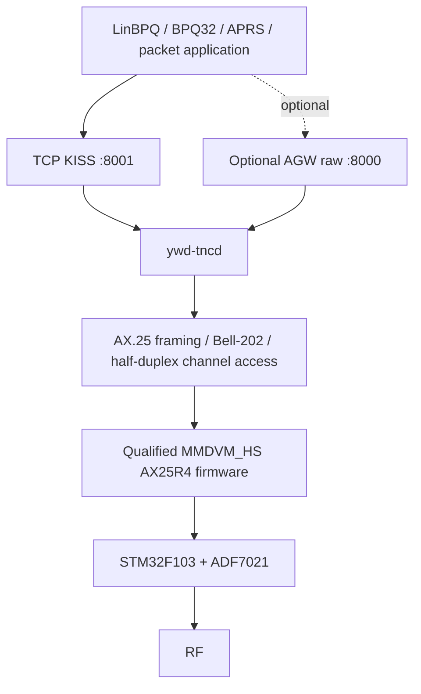

<div align="center">

# YWD-MMDVM-TNC

**A dedicated 1200-baud Bell-202 / AX.25 TNC for supported MMDVM_HS Raspberry Pi HATs**

TCP KISS · optional AGW raw network access · guided installation · reproducible qualified firmware

[](https://github.com/merberg-ai/ywd-mmdvm-tnc/actions/workflows/ci.yml)


</div>

YWD-MMDVM-TNC turns a supported **MMDVM_HS simplex HAT** into a standalone
1200-baud packet modem/TNC for Raspberry Pi. The Raspberry Pi owns the HAT,
Bell-202 modem path, channel access, and RF lifecycle; packet applications talk
to it over **TCP KISS** or the optional **AGW raw-frame network interface**.

It is intentionally a **modem boundary**, not another node or BBS. LinBPQ,
BPQ32, APRS software, terminals, and other packet applications remain responsible
for higher-level AX.25 behavior such as connected-mode state, acknowledgements,
retries, routing, digipeating, BBS/node services, and application logic.

> [!IMPORTANT]
> YWD-MMDVM-TNC is currently an alpha project with a deliberately narrow,
> physically-qualified hardware and RF envelope. Read the hardware and RF
> profile sections before transmitting.

## Table of contents

- [What it does](#what-it-does)
- [Architecture](#architecture)
- [Qualified hardware](#qualified-hardware)
- [Quick install](#quick-install)
- [After installation](#after-installation)
- [RF operating profiles](#rf-operating-profiles)
- [Connect packet software](#connect-packet-software)
  - [TCP KISS](#tcp-kiss)
  - [LinBPQ example](#linbpq-example)
  - [AGW raw mode](#agw-raw-mode)
- [Configuration](#configuration)
- [Firmware management](#firmware-management)
- [How the firmware and host software fit together](#how-the-firmware-and-host-software-fit-together)
- [Troubleshooting](#troubleshooting)
- [Safety model](#safety-model)
- [Qualification](#qualification)
- [Repository layout](#repository-layout)
- [License](#license)

## What it does

YWD-MMDVM-TNC provides a small, single-purpose packet-radio stack around the
MMDVM_HS hardware:

- **1200-baud Bell-202 AFSK / AX.25** receive and transmit through the qualified HAT firmware;
- **TCP KISS** for local or trusted-LAN packet applications;
- an optional **AGW raw-frame network interface**;
- half-duplex channel access and TX delay handling;
- one process with exclusive ownership of the HAT UART;
- fail-closed RF transmit profiles;
- safe firmware identity checks, stock-firmware backup, explicit flashing, and readback verification;
- a guided installer that can reproducibly build the exact qualified firmware image when needed.

YWD-MMDVM-TNC does **not** implement a packet node, BBS, mailbox, AX.25 connected-mode
session manager, routing layer, or APRS application. Those jobs belong to the
software using the TNC.

## Architecture



At runtime, one `ywd-tncd` process owns the modem UART and creates the shared
RX/TX backend used by KISS and, when enabled, AGW raw mode. Incoming RF frames
are delivered live to connected clients; YWD-MMDVM-TNC does not replay historical
RF traffic to newly connected clients.

For connected-mode AX.25, the division of responsibility looks like this:

| YWD-MMDVM-TNC | Packet application |
| --- | --- |
| HAT UART ownership | AX.25 connection state |
| Bell-202 RX/TX | SABM/UA/DISC/session policy |
| KISS / AGW raw transport | acknowledgements and retries |
| bounded TX admission | routing / digipeating |
| TX delay and half-duplex RF lifecycle | node / BBS / APRS logic |
| RF profile enforcement | user-facing application behavior |

## Qualified hardware

The physically-qualified product target is:

| Component | Qualified target |
| --- | --- |
| Host | Raspberry Pi 5 |
| HAT | MMDVM_HS-style **simplex** HAT |
| MCU | STM32F103 |
| RF IC | ADF7021 |
| TCXO profile | 14.7456 MHz |
| Modem UART | `/dev/ttyAMA0` |
| Packet mode | 1200-baud Bell-202 / AX.25 |

Other Raspberry Pi models or MMDVM_HS board variants may share enough hardware
to work, but they are **not represented by the current physical qualification
evidence**. The installer and runtime intentionally reject unsupported product
targets rather than silently guessing.

## Quick install

On Raspberry Pi OS or another supported Debian-family system, run:

```bash
curl -fsSL https://raw.githubusercontent.com/merberg-ai/ywd-mmdvm-tnc/main/install.sh | sudo bash
```

The installer is interactive. It keeps detailed command output under
`/var/log/ywd-mmdvm-tnc/` while the terminal shows the current step, prompts,
warnings, and final result.

### What the installer asks

During setup you choose:

- **KISS access** — local-only (`127.0.0.1`) or trusted-LAN (`0.0.0.0`);
- **KISS TCP port** — default `8001`;
- **RF transmit** — default **disabled**;
- **receive frequency** — default `145.050 MHz` when TX is disabled;
- optional **AGW raw** listener — default disabled on `127.0.0.1:8000`;
- whether to back up, verify, and install the qualified HAT firmware — default yes.

If TX is enabled during the initial guided setup, the installer offers the
historically physically-qualified **145.050 MHz / power-200 packet profile**.
The APRS profile can be selected later with `ywd-tnc-profile`.

### What the installer does

The complete guided path:

1. installs the required host and STM32 build-tool dependencies;
2. verifies the pinned qualification/provenance inputs and in-repo product runtime;
3. installs YWD-MMDVM-TNC under `/opt/ywd-mmdvm-tnc`;
4. creates or preserves `/etc/ywd-mmdvm-tnc/config.toml`;
5. verifies an existing qualified firmware artifact or reproducibly builds it twice as a non-root user;
6. requires the resulting firmware to match the exact accepted size and SHA-256;
7. identifies the HAT and, when starting from recognized stock firmware, creates two independent full-flash rollback reads and verifies they are identical;
8. requires the operator to type `WRITE-FIRMWARE-NOW` immediately before any stock-to-product firmware write;
9. independently reads the programmed bytes back and verifies the running firmware identity;
10. enables and starts `ywd-mmdvm-tnc.service` and prints the configured KISS endpoint.

A firmware write is never hidden inside installation. If a real write is needed,
you will see an explicit warning and must type:

```text
WRITE-FIRMWARE-NOW
```

### Manual installation from Git

```bash
git clone --recursive https://github.com/merberg-ai/ywd-mmdvm-tnc.git
cd ywd-mmdvm-tnc
sudo ./installer/setup.sh
```

The recursive clone is currently required because the installer still verifies
the exact pinned YWD-1278 qualification/provenance anchor. The active product
runtime and HAT support used by YWD-MMDVM-TNC have been brought into this
repository; normal host runtime operation and the production firmware builder
do not import or execute the historical YWD-1278 implementation from the
submodule.

Useful lower-level maintenance scripts are retained for operators and developers:

```text
installer/bootstrap.sh   install OS/toolchain dependencies
installer/install.sh     install/update product files and systemd service
firmware/ensure.sh       verify or build the exact accepted firmware artifact
firmware/build.sh        reproducibly build the exact accepted firmware
firmware/probe.sh        verify the running HAT firmware identity
firmware/flash.sh        probe, back up, verify, or flash through the qualified path
```

## After installation

The main service is:

```text
ywd-mmdvm-tnc.service
```

Useful commands:

```bash
sudo systemctl status ywd-mmdvm-tnc.service
sudo systemctl restart ywd-mmdvm-tnc.service
sudo journalctl -u ywd-mmdvm-tnc.service -f
```

Check the active RF profile with:

```bash
ywd-tnc-profile status
```

The default KISS endpoint is local-only:

```text
127.0.0.1:8001
```

If you selected trusted-LAN access during installation, the service binds to
`0.0.0.0:8001`; clients connect to the Raspberry Pi's **actual LAN IP address**,
not to `0.0.0.0`.

Installed files live primarily at:

```text
/opt/ywd-mmdvm-tnc/source
/opt/ywd-mmdvm-tnc/venv
/etc/ywd-mmdvm-tnc/config.toml
/var/lib/ywd-mmdvm-tnc
/var/log/ywd-mmdvm-tnc
/etc/systemd/system/ywd-mmdvm-tnc.service
```

## RF operating profiles

RF transmit is deliberately bounded. The current product accepts only the named
operating profiles below; arbitrary TX frequency/power combinations are rejected.

| Profile | Frequency | TX power | TX state | Status |
| --- | ---: | ---: | --- | --- |
| `packet` | 145.050 MHz | 200/255 | enabled | **physically qualified historical packet profile** |
| `aprs` | 144.390 MHz | 200/255 | enabled | permitted APRS operational profile; **not separately physically qualified** |
| `rx-only` | current frequency | current power value | disabled | receive-only safety mode |

Switch profiles with:

```bash
sudo ywd-tnc-profile packet
sudo ywd-tnc-profile aprs
sudo ywd-tnc-profile rx-only

ywd-tnc-profile status
```

A profile change is transactional. The tool:

1. reads `/etc/ywd-mmdvm-tnc/config.toml`;
2. changes only `radio.frequency_mhz`, `radio.tx_power`, and `radio.tx_enabled`;
3. validates the complete candidate configuration;
4. saves the previous configuration as `/etc/ywd-mmdvm-tnc/config.toml.bak`;
5. atomically replaces the configuration;
6. restarts `ywd-mmdvm-tnc.service`;
7. restores the previous configuration and attempts to restart it if the new service start fails.

For implementation details, see [`docs/rf-profiles.md`](docs/rf-profiles.md).

> [!CAUTION]
> The `aprs` profile is intentionally permitted by the product but does not carry
> the same historical physical qualification claim as the 145.050 MHz packet
> profile. You are responsible for choosing legal frequencies, power, antenna,
> identification, and operating practices for your station and location.

### Application handoff

Normally, give only **one packet application at a time** authority to originate
frames through a particular YWD-MMDVM-TNC instance. Stop or disconnect the old
KISS/AGW client, switch the RF profile if necessary, and then start the next
application. `ywd-tncd` remains the single owner of the physical HAT throughout.

## Connect packet software

### TCP KISS

TCP KISS is the primary application interface and defaults to port `8001`.

For an application on the same Raspberry Pi, the safe default is:

```text
127.0.0.1:8001
```

For another machine on a trusted LAN, configure:

```toml
[kiss]
enabled = true
listen = "0.0.0.0"
port = 8001
allow_wildcard_bind = true
```

Then point the remote application at the Raspberry Pi's actual address, for
example:

```text
192.168.1.50:8001
```

`0.0.0.0` is a **bind address**, not a destination address.

> [!WARNING]
> KISS has no authentication or encryption. Do not expose TCP/8001 directly to
> the public Internet, an untrusted wireless network, or an unrestricted tunnel
> or VPN interface. Use appropriate host/network firewall rules.

### LinBPQ example

YWD-MMDVM-TNC has been physically tested with LinBPQ running on another LAN host
using TCP KISS in both directions, including sustained connected-mode traffic
and multi-frame transfers.

A typical LinBPQ port is:

```text
PORT
 ID=YWD-MMDVM-TNC
 TYPE=ASYNC
 PROTOCOL=KISS
 IPADDR=192.168.1.50
 TCPPORT=8001
 KISSOPTIONS=NOPARAMS
 FRACK=7000
 RESPTIME=1000
 RETRIES=10
 MAXFRAME=2
 PACLEN=128
 TXDELAY=300
 SLOTTIME=100
 PERSIST=63
 FULLDUP=0
ENDPORT
```

Replace `192.168.1.50` with the YWD-MMDVM-TNC Raspberry Pi's actual LAN address.

`KISSOPTIONS=NOPARAMS` is intentional in the qualified example: it prevents
LinBPQ from overriding the TNC's configured TXDELAY/PERSIST/SLOTTIME values.
LinBPQ remains responsible for FRACK, retries, MAXFRAME, PACLEN, AX.25 connection
state, routing, node behavior, and related policy.

More detail and qualification notes are in
[`docs/linbpq-lan-p3.md`](docs/linbpq-lan-p3.md).

### AGW raw mode

YWD-MMDVM-TNC can optionally expose an **AGW network-protocol raw-frame subset**.
The default listener is:

```text
127.0.0.1:8000
```

Enable it with:

```toml
[agw]
enabled = true
listen = "127.0.0.1"
port = 8000
allow_wildcard_bind = false
raw_only = true
```

This is deliberately **not a claim of full AGWPE server compatibility**. The
implementation provides the raw packet interface needed to share the same modem
backend with compatible applications while keeping AX.25 session/application
logic outside YWD-MMDVM-TNC.

## Configuration

The main configuration file is:

```text
/etc/ywd-mmdvm-tnc/config.toml
```

A safe local-only, receive-only configuration looks like:

```toml
[hardware]
target = "mmdvm-hs-hat-stm32f103-simplex-14.7456-adf7021"

[radio]
device = "/dev/ttyAMA0"
frequency_mhz = 145.050
tx_power = 200
tx_enabled = false

[packet]
baud = 1200
txdelay_ms = 300
persist = 63
slottime_ms = 100

[kiss]
enabled = true
listen = "127.0.0.1"
port = 8001
allow_wildcard_bind = false

[agw]
enabled = false
listen = "127.0.0.1"
port = 8000
allow_wildcard_bind = false
raw_only = true

[firmware]
required_identity = "MMDVM_HS_Hat-YWD-1278-AX25R4-v0.1.0-alpha1 14.7456MHz ADF7021 FW based on CA6JAU GitID #7ff74ed"
allow_automatic_flash = false
```

The runtime validates the complete configuration before taking ownership of the
modem. With TX enabled, the configured frequency and power must match an
explicitly permitted product RF profile. Automatic firmware flashing remains
hard-disabled at runtime.

The installer manages only the TNC's hardware, radio, packet timing, listener,
and firmware settings. It does not generate LinBPQ/BPQ node, BBS, routing,
mailbox, APRS, or application configuration.

## Firmware management

The normal installer is intentionally conservative. If the exact accepted
firmware is already running, it verifies it instead of needlessly rewriting
STM32 flash.

For an explicit firmware update or deliberate reflash of the currently accepted
image, use:

```bash
sudo ywd-update-firmware
```

The updater does **not** accept an arbitrary `.bin`. It reads the repository-owned
`firmware/accepted-firmware.json` registry, verifies the active profile and
artifact, requires a verified stock rollback backup where applicable, and still
requires `WRITE-FIRMWARE-NOW` before writing main flash. Programmed bytes are
read back and verified before the HAT is restarted.

### Build the exact accepted firmware

Firmware builds are intentionally non-root:

```bash
./firmware/build.sh
```

The production wrapper runs `firmware/build-qualified-inrepo.py`. It materializes
the byte-pinned engineering transforms from this repository, fetches only the
pinned upstream MMDVM_HS source/submodule revisions recorded in the manifest,
performs two independent builds, requires them to be byte-identical, and then
requires the resulting artifact to match the accepted size and SHA-256.

The build path does **not** execute the historical YWD-1278 firmware builder.
No HAT, GPIO, flash, or RF access occurs during the build.

### Probe the running HAT firmware

The service owns the UART, so stop it before a manual probe:

```bash
sudo systemctl stop ywd-mmdvm-tnc.service
sudo /opt/ywd-mmdvm-tnc/source/firmware/probe.sh
sudo systemctl start ywd-mmdvm-tnc.service
```

The probe performs the firmware identity transaction only; it does not configure
RF or write flash.

### Back up recognized stock firmware

```bash
sudo ./firmware/flash.sh backup
```

A valid stock backup uses two independent full main-flash reads. They must be
byte-identical and match the qualified stock SHA-256 before the backup is
accepted.

### Manually install or verify the accepted firmware

Build it first if needed:

```bash
./firmware/build.sh
```

Then use the qualified deployment path:

```bash
sudo ./firmware/flash.sh flash --authorize FLASH-QUALIFIED-AX25R4
```

If the exact accepted firmware is already installed, the normal path verifies
programmed bytes without rewriting main flash. If recognized stock firmware is
running, the tool first creates/verifies the protected rollback backup and then
asks for `WRITE-FIRMWARE-NOW` immediately before the write. STM32 option bytes
are never written.

## How the firmware and host software fit together

There are two separate version/provenance domains in this project:

1. **YWD-MMDVM-TNC host software** — the Python service, installer, configuration,
   KISS/AGW interfaces, RF-profile policy, and maintenance tooling;
2. **the immutable physically-qualified HAT firmware artifact** — retained byte
   for byte so its existing qualification evidence remains valid.

The accepted RF-critical modem firmware is the exact AX25R4 image with this
historical runtime identity:

```text
MMDVM_HS_Hat-YWD-1278-AX25R4-v0.1.0-alpha1 14.7456MHz ADF7021 FW based on CA6JAU GitID #7ff74ed
```

That older-looking firmware identity is intentional. It is **not** the version
number of the current YWD-MMDVM-TNC host package. Changing the string would
change the binary and invalidate the exact byte-level qualification anchor.

Qualified firmware artifact details:

| Property | Value |
| --- | --- |
| Canonical path | `firmware/out/0c-p2-rssi-ax25r4-stm32f103-simplex-adf7021-14.7456tcxo-8mhz-hse/` |
| Size | `59,892` bytes |
| SHA-256 | `b06fcbf0baa36e865198091cee27c66e1624ef08117ee685253a7a5613c7c616` |
| Flash base | `0x08000000` |
| STM32 bootloader | `0x22` |
| STM32 device ID | `0x0410` |

The current in-repo firmware engineering path is centered around:

```text
firmware/build-qualified-inrepo.py
firmware/tooling/packet-rssi-build-manifest.json
firmware/tooling/qualified-toolchain.json
firmware/vendor/ywd-mmdvm/
```

The byte-identical build environment is recorded in
`firmware/tooling/qualified-toolchain.json`; the qualified ARM compiler is GCC
`14.2.1`. CI pins the relevant Debian Trixie build environment and toolchain
versions used to reproduce the accepted image.

### YWD-1278 provenance anchor

The historical qualified YWD-1278 core is pinned at:

```text
c28c46c3478d7931af611923c92cd8f692a00858
```

The repository keeps that submodule and verifies the pin during installation as
part of the project's qualification/provenance chain. The active product package
contains its frozen runtime support under `src/ywd1278`, and the product HAT
probe/control and deterministic firmware-build support are carried directly in
this repository. This keeps normal YWD-MMDVM-TNC operation self-contained while
preserving traceability to the original engineering lineage.

## Troubleshooting

### Service will not stay running

Start with:

```bash
sudo systemctl status ywd-mmdvm-tnc.service --no-pager
sudo journalctl -u ywd-mmdvm-tnc.service -n 100 --no-pager
```

Common causes include an unexpected HAT firmware identity, an invalid RF profile,
or another process holding the modem UART.

### Check the current RF profile

```bash
ywd-tnc-profile status
```

If you want a safe receive-only state while troubleshooting:

```bash
sudo ywd-tnc-profile rx-only
```

### Check whether KISS is listening

```bash
sudo ss -ltnp | grep ':8001'
```

For local-only mode, expect a listener on `127.0.0.1:8001`. For trusted-LAN mode,
expect `0.0.0.0:8001` and connect clients to the Pi's actual LAN address.

### A remote KISS client cannot connect

Check all three of these:

- `[kiss].listen` is `0.0.0.0`;
- `[kiss].allow_wildcard_bind` is `true`;
- the host/network firewall permits the chosen KISS TCP port from the trusted LAN.

Do not configure the remote application to connect to `0.0.0.0`.

### Firmware probe says the UART is busy

`ywd-mmdvm-tnc.service` normally owns the UART. Stop it before manually running
`firmware/probe.sh` or low-level firmware maintenance tools, then start it again
when finished.

### Detailed installer logs

Installer and maintenance logs are kept under:

```text
/var/log/ywd-mmdvm-tnc/
```

## Safety model

YWD-MMDVM-TNC intentionally fails closed around the two things most likely to
cause trouble: **RF transmit authority** and **firmware writes**.

- RF TX defaults disabled.
- TX must match one of the explicitly permitted product profiles.
- 145.050 MHz / power-200 is the historical physically-qualified packet TX profile.
- 144.390 MHz / power-200 is an explicitly permitted APRS operational profile, not a separate historical physical qualification claim.
- Arbitrary transmit frequencies and power values are rejected.
- Installation does not silently enable TX.
- Firmware writes are never automatic or silent.
- A verified stock rollback image is required before a stock-to-product write.
- Programmed firmware is independently read back and verified.
- STM32 option bytes are never written.
- One process owns the HAT UART.
- KISS and AGW clients receive live frames only; historical RF packets are not replayed to new clients.
- Connected-mode retries/session state remain in the external packet stack, not in the modem service.

These software safeguards do not replace the operator's responsibility to obey
applicable amateur-radio rules and good RF engineering practice.

## Qualification

The stable product line has passed physical tests for:

- live Bell-202 / AX.25 receive on the qualified HAT;
- one-shot TCP KISS transmit with independent over-air decode;
- RX recovery on the same KISS connection after TX;
- no automatic modem-layer TX retry;
- remote LAN TCP KISS operation;
- real LinBPQ bidirectional interoperability;
- sustained connected-mode traffic and multi-frame transfers;
- the complete fresh-stock-HAT public installation path, including one-command bootstrap, guided configuration, reproducible non-root firmware build, exact artifact verification, protected two-pass stock backup, explicit flash confirmation, stock-to-qualified firmware deployment, service startup, and working LinBPQ TX/RX afterward;
- the accepted-firmware explicit update/reflash path.

Machine-readable evidence is kept under [`qualification/`](qualification/), and
historical `checkpoint/*` branches preserve important qualification milestones.
The public stock-HAT installer record is:

```text
qualification/public-stock-hat-install-physical-2026-09-07.json
```

The project deliberately distinguishes **physically qualified**, **host/CI
qualified**, and merely **permitted** behavior. A green CI result is not used as
a substitute for over-air hardware qualification.

## Repository layout

```text
.github/workflows/    CI and qualification contracts
config/               example product configuration
docs/                 focused operator/integration documentation
firmware/             accepted firmware registry, build, probe and flash tooling
installer/            guided installer and installation helpers
qualification/        machine-readable physical qualification evidence
scripts/              qualification and maintenance helpers
src/ywdtnc/           YWD-MMDVM-TNC product layer
src/ywd1278/          frozen in-repo modem/runtime support
tests/                host-side unit and contract tests
systemd/              service definitions
vendor/ywd-1278/      pinned historical qualification/provenance submodule
```

Development occurs on `dev` and focused feature/testing branches. `main` is the
stable public installation branch used by the one-line installer. Historical
qualification checkpoint branches are intentionally retained as evidence rather
than treated as normal development branches.

## License

Host-side YWD code is licensed **GPL-2.0-or-later**. Firmware derived from
MMDVM_HS retains its applicable upstream GPL notices and attribution.

See [`LICENSING.md`](LICENSING.md) and the pinned vendor/provenance sources for
details.
